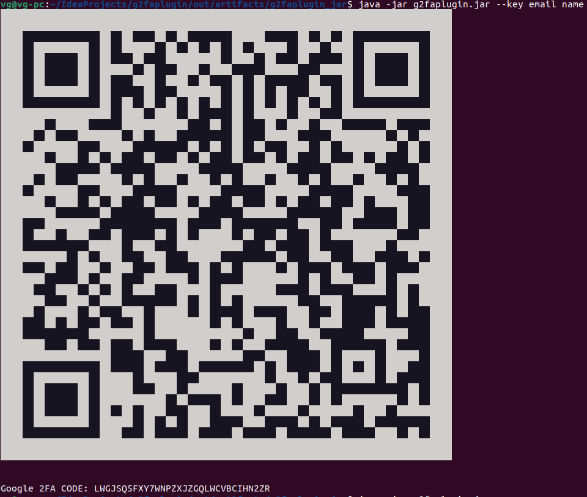

# 
2023-06    
## OpenVPN Google 2FA plugin :

Simple plugin to have single user Google 2FA autentification to OpenVpn

## APPLICATION folder have wraped jar versions of application.
     |--> g2faplugin.sh     -- linux version (first line java path, after download set chmod +x g2faplugin.sh).
     |--> g2faplugin.exe    -- windows (nead set JAVA_HOME environment variable picture2.png). 

## Usage
Copy application to OpenVpn  directory.
In openvpn config set: auth-user-pass-verify g2faplugin.[exe|sh] via-env
run g2faplugin.[exe|sh] --key email name 

Use QR code or Key in[ Google Autentificator](https://play.google.com/store/apps/details?id=com.google.android.apps.authenticator2&hl=en_US)

## OpenVpn client
username can be any password - Google 2FA Code

_report bugs suggestions :)
mail.: vytasgadliauskas@gmail.com_

